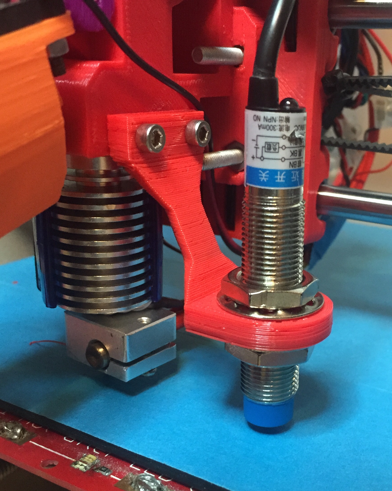

# Proximity Sensor Holder

Inductive Proximity Holder for Prusa i3 Rework 1.0 Wade extruder body.

This proximity sensor holder is for the "Inductive Proximity Sensor Detection Switch NPN 4mm DC6-36V LJ12A3-4-Z/BX".

I bought this sensor in eBay to [ouyou2010](http://www.ebay.co.uk/usr/ouyou2010?_trksid=p2047675.l2559)

It can be found [here](http://www.ebay.co.uk/itm/131402459032?_trksid=p2057872.m2749.l2649&ssPageName=STRK%3AMEBIDX%3AIT).

The extruder body that I have is [this one](http://www.thingiverse.com/thing:119616).

I've created this in [FreeCAD](http://freecadweb.org/) from scratch but inspired from the work of [photogravinci](http://www.thingiverse.com/fotogravinci).

Main goals for this design are:

- Right for the Wade Extruder of the Prusa i3 rework.
- 3D printable without supports.
- Small profile and rounded edges for low resistance to air flow from hot end fan.
- Keeps its distance from the hot end to avoid overheating.

